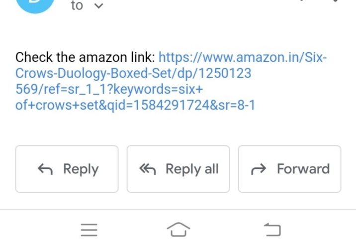
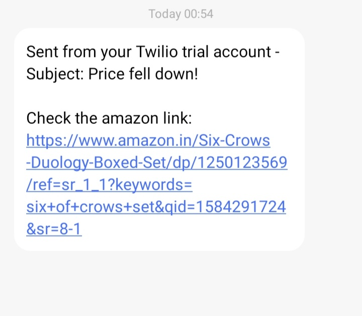

# Amazon Price Tracker :moneybag:	
**Python project - Parsing**

A script to check whether the price of Six Crows Duology bookset has reduced below ₹2,100. Whenever the price falls, an email :e-mail: and sms :inbox_tray:
 gets sent to the users accounts along with the link of the URL of the product on Amazon. The email is sent by the built in `smtplib` and the sms is sent through `twilio`. 

 
   

## Installation
1. Install BeautifulSoup: `pip install beautifulsoup4`
2. Install Twillio: `pip install twilio`

## Usage
1. Get all your required credentials form twillio and google
2. Add them to necessary locations in scraper.py
3. Run scraper.py file `python scraper.py`
